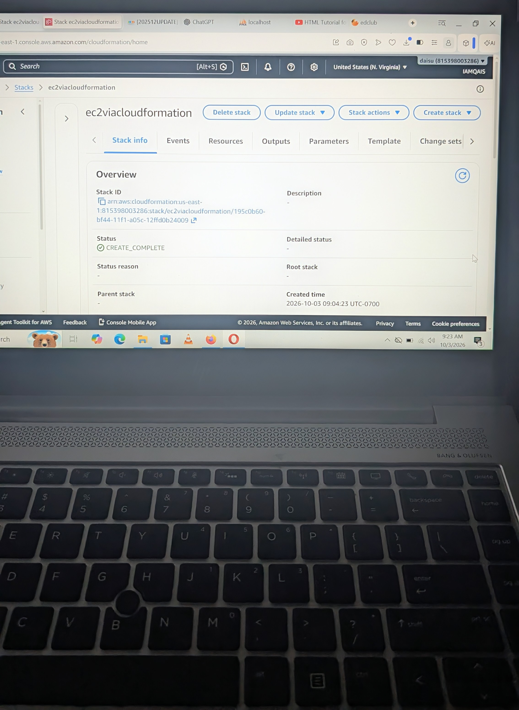

EC2 Instance Using AWS CloudFormation

CloudFormation is an Infrastructure as Code (IaC) service.
In this lab, I created an EC2 instance using AWS CloudFormation.

The procedure 

CloudFormation Stack → YAML Template → EC2 Instance

Stack picture 

What I Learned

How to create an EC2 instance using CloudFormation

How a YAML template defines AWS resources

How CloudFormation provisions resources through a stack.
